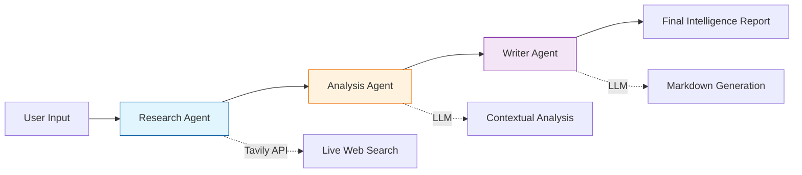

# Agentic Market Research Orchestrator

[](https://www.python.org/downloads/release/python-3120/)
[](https://opensource.org/licenses/MIT)
[](https://github.com/astral-sh/ruff)
[](https://www.docker.com/)
[](https://huggingface.co/spaces/pkgprateek/agentic-market-research)

> **Enterprise-grade multi-agent system for automated competitive intelligence.**  
> Delivers comprehensive market research reports in 15 minutes at <1% of the cost of traditional methods.

---

## 🚀 Overview

The **Agentic Market Research Orchestrator** is a sophisticated AI system designed to automate the labor-intensive process of competitive market analysis. By orchestrating a team of specialized AI agents, it transforms a simple company name into a strategic intelligence report, covering SWOT analysis, competitor landscape, and market positioning.

**Key Value Proposition:**
*   **Speed:** Reduces research time from 20+ hours to ~15 minutes (80x faster).
*   **Cost Efficiency:** Lowers cost from ~$3,000 to $0.50-$2.00 per report (1500x cheaper).
*   **Scalability:** Standardized, reproducible outputs suitable for high-volume analysis.

## 🏗️ Architecture

The system utilizes a **LangGraph** state machine to coordinate three specialized agents, ensuring a robust and fault-tolerant workflow.



### Agent Roles
1.  **Research Agent:** Executes targeted web searches using Tavily API to gather raw data on competitors, pricing, and features.
2.  **Analysis Agent:** Synthesizes raw data into structured insights, performing SWOT and gap analysis.
3.  **Writer Agent:** Compiles insights into a professional, citation-backed Markdown report.

## 🛠️ Tech Stack

*   **Orchestration:** [LangGraph](https://langchain-ai.github.io/langgraph/) (State management & coordination)
*   **LLM Integration:** [OpenRouter](https://openrouter.ai/) (Access to Claude 3.5 Sonnet, GPT-4o, etc.)
*   **Search:** [Tavily AI](https://tavily.com/) (Optimized for LLM research)
*   **Backend:** [FastAPI](https://fastapi.tiangolo.com/) (Async REST API)
*   **Frontend:** [Gradio](https://www.gradio.app/) (Interactive UI)
*   **Infrastructure:** Docker & Docker Compose

## ⚡ Quick Start

### Prerequisites
*   Python 3.12+
*   Docker (optional)
*   API Keys: OpenRouter, Tavily

### Local Installation

1.  **Clone the repository:**
    ```bash
    git clone https://github.com/pkgprateek/agentic-market-research.git
    cd agentic-market-research
    ```

2.  **Set up environment:**
    ```bash
    python -m venv venv
    source venv/bin/activate
    pip install -e .  # Installs project in editable mode (Professional)
    # Or: pip install -r requirements.txt (Legacy)
    ```

3.  **Configure credentials:**
    ```bash
    cp .env.example .env
    # Edit .env with your OPENROUTER_API_KEY and TAVILY_API_KEY
    ```

4.  **Run the application:**
    ```bash
    # Run
    python src/ui/app.py
    # Open http://localhost:7860
    ```

### Docker Deployment

```bash
docker-compose up --build
```

## 🧪 Testing & Quality Assurance

This project maintains high code quality standards with comprehensive testing and linting.

## Testing

Run the full test suite (Linting, Type Checking, Unit & Integration Tests):

```bash
./scripts/run_all_tests.sh
```

Or run individually:

```bash
ruff check src/ tests/       # Linting
mypy src/                    # Type Checking
pytest tests/unit/ -v        # Unit Tests
pytest tests/integration/ -v # Integration Tests
```

## 📊 Performance Metrics

| Metric | Manual Analyst | Agentic Orchestrator | Improvement |
| :--- | :--- | :--- | :--- |
| **Time to Report** | 20 Hours | 15 Minutes | **80x** |
| **Cost per Report** | ~$3,000 | ~$1.50 | **2000x** |
| **Consistency** | Variable | High | **Standardized** |

## 🤝 Contributing

Contributions are welcome! Please feel free to submit a Pull Request.

## 📄 License

This project is licensed under the MIT License - see the [LICENSE](LICENSE) file for details.

---

**Built by Prateek Kumar Goel**  
[GitHub](https://github.com/pkgprateek) | [LinkedIn](https://linkedin.com/in/pkgprateek)
