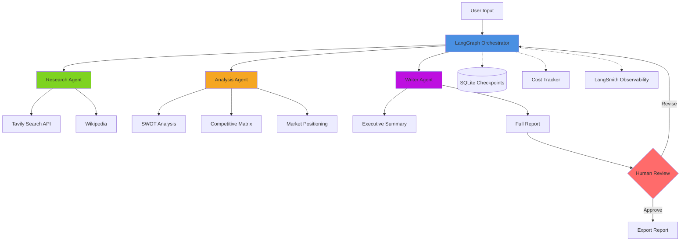

# Market Intelligence Agent System

AI-powered competitive intelligence automation using multi-agent orchestration. Replaces 20 hours of manual research with 15 minutes of automated analysis.

## Problem Statement

Competitive market research is expensive ($3,000) and time-consuming (20 hours) when done manually. Decision-makers need faster, more cost-effective intelligence.

## Solution

Multi-agent AI system that automatically:
- Gathers competitive intelligence via web search
- Analyzes market positioning with SWOT framework
- Generates professional business intelligence reports
- Delivers consistent results in 15 minutes for $0.50-$2

## Architecture



### Agent Responsibilities

**Research Agent**: Executes 3 specialized search queries (company overview, competitors, market trends) via Tavily API. Processes and structures raw search results for downstream analysis.

**Analysis Agent**: Performs SWOT analysis, builds competitive positioning matrix, identifies strategic opportunities using LLM reasoning over research data.

**Writer Agent**: Generates executive summary and comprehensive markdown report with proper citations and professional formatting.

**Orchestrator**: Manages agent coordination, state persistence via SQLite checkpoints, error recovery, and cost enforcement.

## Technology Stack

| Component | Technology | Purpose |
|-----------|-----------|---------|
| Orchestration | LangGraph 1.0.4 | Multi-agent state management |
| LLM Access | OpenRouter API | Cost-optimized model routing |
| Search | Tavily API | Web search and data gathering |
| Observability | LangSmith | Production monitoring and debugging |
| API | FastAPI | REST endpoints |
| UI | Gradio | Interactive web interface |
| Deployment | Docker | Containerized deployment |
| Testing | pytest | 33 tests (29 unit, 4 integration) |

## Quick Start

### Prerequisites

- Python 3.12+
- OpenRouter API key ([sign up](https://openrouter.ai))
- Tavily API key ([sign up](https://tavily.com))

### Installation

```bash
git clone https://github.com/pkgprateek/agentic-research-orchestrator.git
cd agentic-research-orchestrator

python -m venv venv
source venv/bin/activate

pip install uv
uv pip install -r requirements.txt

cp .env.example .env
# Edit .env with your API keys
```

### Usage

**Interactive UI:**
```bash
python src/ui/app.py
# Open http://localhost:7860
```

**REST API:**
```bash
uvicorn src.api.main:app --reload
# API docs at http://localhost:8000/docs
```

**Python API:**
```python
from src.workflows.intelligence import MarketIntelligenceWorkflow

workflow = MarketIntelligenceWorkflow()
result = await workflow.run(
    company_name="Tesla Model Y",
    industry="Electric Vehicles"
)
print(result["full_report"])
```

**Docker:**
```bash
docker-compose up
# API: http://localhost:8000
#  UI: http://localhost:7860
```

## Model Configuration

Supports 400+ models via OpenRouter. Built-in configurations:

**Free Tier** (testing):
- `x-ai/grok-4.1-fast:free` - Default, $0.00
- `meta-llama/llama-3.3-70b-instruct:free` - Alternative

**Production**:
- `anthropic/claude-sonnet-4.5` - Best reasoning
- `google/gemini-2.5-flash-lite` - Fast, cost-effective
- `openai/gpt-5-mini` - Balanced performance

Configure in `.env`:
```bash
DEFAULT_MODEL=x-ai/grok-4.1-fast:free
MAX_COST_PER_RUN=2.0
```

## Cost Economics

| Approach | Time | Cost | Quality |
|----------|------|------|---------|
| Manual Research | 20 hours | $3,000 | Variable |
| This System | 15 minutes | $0.50-$2 | Consistent |
| **Improvement** | **80x faster** | **1500-6000x cheaper** | **Standardized** |

Typical per-analysis costs:
- Free tier (Grok): $0.00
- Development (GPT-5 Mini): $0.10-$0.50
- Production (Claude 4.5): $1.00-$2.00

## Testing

```bash
# Run all tests
pytest tests/ -v

# With coverage
pytest tests/ --cov=src --cov-report=html

# Unit tests only
pytest tests/unit/ -v
```

Current coverage: 29 unit tests + 4 integration tests, all passing.

## Project Structure

```
agentic-research-orchestrator/
├── src/
│   ├── agents/              # Research, Analysis, Writer agents
│   ├── workflows/           # LangGraph state and orchestration
│   ├── tools/               # Tavily search wrapper
│   ├── utils/               # Config, logging, cost tracking
│   ├── api/                 # FastAPI REST endpoints
│   └── ui/                  # Gradio interface
├── tests/
│   ├── unit/                # Unit tests
│   └── integration/         # Integration tests
├── docs/                    # Documentation
├── scripts/                 # Utility scripts
├── Dockerfile               # Container configuration
└── docker-compose.yml       # Multi-service deployment
```

## Production Features

- **Cost Tracking**: Real-time token and cost monitoring with budget enforcement
- **State Persistence**: SQLite checkpoints for crash recovery
- **Error Handling**: Graceful degradation with detailed error reporting  
- **Observability**: LangSmith integration for debugging and performance analysis
- **Human-in-the-Loop**: Approval workflow before final report delivery
- **Async Execution**: Background task processing via FastAPI
- **Health Checks**: API endpoint monitoring

## API Endpoints

| Endpoint | Method | Purpose |
|----------|--------|---------|
| `/analyze` | POST | Start new analysis |
| `/status/{run_id}` | GET | Check analysis progress |
| `/result/{run_id}` | GET | Retrieve completed report |
| `/history` | GET | List past analyses |
| `/health` | GET | Health check |

Auto-generated documentation available at `/docs` when API is running.

## Documentation

- [Workflow Architecture](docs/WORKFLOW.md) - Technical implementation details
- [API Reference](http://localhost:8000/docs) - Interactive API documentation

## Deployment

**Local Development:**
```bash
docker-compose up
```

**Production Deployment:**
1. Configure environment variables in `.env`
2. Build container: `docker build -t market-intelligence .`
3. Run: `docker run -p 8000:8000 -p 7860:7860 market-intelligence`

For production deployments, configure:
- Persistent volume for checkpoint storage
- Reverse proxy (nginx) with SSL
- Resource limits and auto-scaling
- Monitoring and alerting

## Limitations

- Requires internet connection for LLM and search APIs
- Quality depends on availability of public information
- Free tier models have rate limits
- Analysis limited to publicly available data
- English language only (currently)

## License

MIT License - see [LICENSE](LICENSE) file.

## Technical Highlights

**For Portfolio/Resume:**
- Multi-agent orchestration with LangGraph
- Production error handling and state management
- Cost optimization ($0-$2 vs $3,000 manual)
- Comprehensive testing (33 tests)
- Docker deployment with multi-service architecture
- REST API with async processing
- Real-time observability integration

**Business Value:**
- 80x time reduction (20 hours to 15 minutes)
- 1500-6000x cost reduction ($3,000 to $0.50-$2)
- Consistent, reproducible results
- Scales to unlimited analyses
- No human bottleneck

---

Built by Prateek Kumar Goel | [GitHub](https://github.com/pkgprateek/agentic-research-orchestrator)
